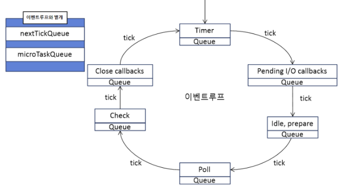

# 1. 리액트 개발을 위해 꼭 알아야 할 자바스크립트

## 태스크 큐와 마이크로 태스크 큐
마이크로큐가 우선권을 가진다. 마이크로 태스크 큐가 빌 때까지 기존 태스크 큐의 실행은 뒤로 미루어진다.

- 태스크 큐: setTimeout, setInterval, setImmediate
- 마이크로 태스크 큐: process.nextTick, Promises, queueMicroTask, MutationObserver

### 이벤트 루프 구조


#### setTimeout 
timer phase에서 작업 

#### setImmediate
check phase에서 작업
- 브라우저마다 최소시간 단위로 설정이 아닌, 즉시 큐에 등록되는 메소드

#### process.nextTick
nextTickQueue에서 관리 (별개로 빠져있는 두 큐는 다른 phase로 넘어가기 전 먼저 실행 됨)
- 콜백을 인수로 취하여 대기 중인 I/O 이벤트 대기열의 앞으로 밀어 넣고 즉시 반환
- 현재 진행 중인 작업이 제어를 이벤트 루프로 넘기는 즉시 콜백이 실행

#### queueMicroTask
- 최종 정리 작업이나 렌더링 바로 직전 실행해야 하는 작업이 필요한 라이브러리와 프레임워크에서 마이크로태스크를 유용하게 사용 가능
- 브라우저가 실행 맥락을 다시 통제하기 전에 필요한 작업을 처리할 수 있기 때문에, 현재 대기 중인 더 중요한 코드에 간섭하지 않을 수 있음
- 태스크 큐보다 우선순위가 높음

#### MutationObserver
- MutationObserver는 특정 dom의 변경을 감시하는 기능을 제공
- https://developer.mozilla.org/ko/docs/Web/API/MutationObserver

렌더링은? 마이크로 태스크 큐를 실행한 뒤 렌더링이 일어남.각 마이크로 태스크 큐 작업이 끝날 때마다 한 번씩 렌더링할 기회를 얻게 됨
즉, 브라우저에 렌더링하는 작업은 마이크로 태스크 큐와 태스크 큐 사이에 일어남

=> 동기 코드는 물론 마이크로 태스크 또한 마찬가지로 렌더링에 영향을 미칠 수 있다. 특정 렌더링이 자바스크립트 내 무거운 작업과 연관이 있다면 이를 어떤 식으로 분리할지 고민해야함

## 1.7 선택이 아닌 필수, 타입스크립트

### 불가피하게 아직 타입을 단정할 수 없는 경우 unknown 사용하자 (toptype)
unknown으로 선언된 변수는 type narrowing하여 사용

### bottomtype never : 어떠한 타입도 들어올 수 없음을 의미
예시: 빈 props를 가진 컴포넌트 선언 시 사용
```javascript
// string이 키지만 값은 never. 어떠한 값도 올 수 없다
type Props = Record<string, never>
```

