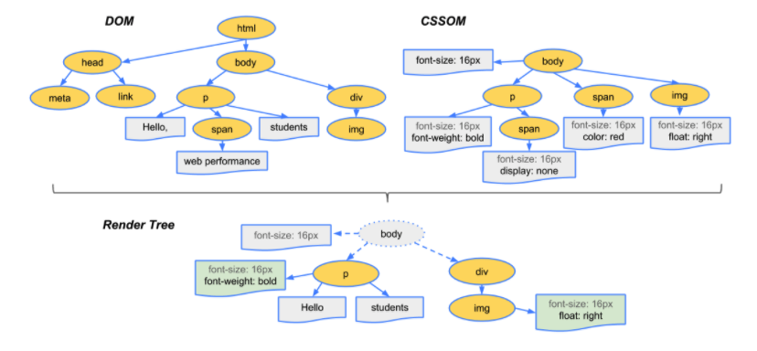

# 2장 - 리액트 핵심 요소 깊게 살펴보기

## 1 JSX란?
- JSX는 트랜스파일러를 통해 자바스크립트 코드로 변화된다.
- 자바스크립트 코드 내부에 HTML과 같은 트리 구조를 가진 컴포넌트를 표현할 수 있다.

### 1.1 JSX의 정의
- `JSXElement`
  - self close 혹은 열고 닫는 형태- 요소명은 반드시 대문자 (태그명과 구분)
- `JSXAttributes`
  - JSXElement에 부여할 수 있는 속성
  - 리액트 컴포넌트를 {}로 감싸는 건 prettier의 규칙
- `JSXChildren`
  - JSXElement의 자식 값
  - 빈 JSX 요소인 <></>(JSXFragment) 사용 가능
- `JSXStrings`
  - 이스케이프 문자 주의

### 1.3 JSX는 어떻게 자바스크립트에서 변환될까?
- @babel/plugin0transform-react-jsx 플러그인이 JSX를 자바스크립트로 변환
- 리액트 17, 바벨 7.9.0 이후 버전에서 자동 런타임(automatic runtime) 추가

#### JSX
```javascript
const ComponentA = <A required={true}>Hello World</A>

const ComponentB = <>Hello World</>

const ComponentC = (
    <div>
        <span>hello world</span>
    </div>
)
```  

#### @babel/plugin-transform-react-jsx 변환
```javascript
'use strict'

var ComponentA = React.createElement(
    A,
    {
        required: true,
    },
    'Hello World',
)
var ComponentB = React.createElement(React.Fragment, null, 'Hello World')
var ComponentC = React.createElement(
    'div',
    null,
    React.createElement('span', null, 'hello world'),
)
```


## 2 가상 DOM과 리액트 파이버

### 2.1 DOM과 브라우저 렌더링 과정
- DOM: 브라우저가 웹페이지의 콘텐츠와 구조를 어떻게 보여줄지에 대한 정보를 담고 있다.
- DOM과 - [CSSOM](https://developer.mozilla.org/ko/docs/Web/API/CSS_Object_Model)으로 렌더링 트리가 만들어지는 과정으로 렌더링 트리가 만들어지는 과정 (129p)


### 2.2 가상 DOM의 탄생 배경
- 가상DOM: 실제 브라우저가 아닌 리액트가 관리하는 가상의 DOM
- 렌더링이 완료된 이후 사용자의 인터랙션으로 웹페이지가 변경되는 상황에서 렌더링 비용을 줄이기 위해
- 대부분의 상황에서 가상 DOM이 빠르지만, 무조건 빠른것은 아니다.

### 2.3 가상 DOM을 위한 아키텍처, 리액트 파이버

#### 리액트 파이버란?
- 리액트에서 관리하는 자바스크립트 객체
- 가상 DOM과 실제 DOM을 비교해 변경사항이 있으면 화면에 렌더링을 요청하는 역할
- 모든 과정이 비동기로 이루어진다.
- child, sibling, return: 파이버 간의 관계 개념을 나타내는 속성
  ```javascript
  <ul>
    <li>하나</li>
    <li>둘</li>
    <li>셋</li>
  </ul>
  ```

  ```javascript
  const l3 = {
    return: ul,
    index: 2,
  }

  const l2 = {
    sibling: l3,
    return: ul,
    index: 1,
  }

  const l1 = {
    sibling: l2,
    return: ul,
    index: 0,
  }

  const ul = {
    // ...
    child: l1,
  }
  ```

#### 리액트 파이버 트리
- 파이버 트리: 현재 모습을 담은 트리
- workInProgress 트리: 작업중인 상태를 나타내는 트리
- 리액트 파이버의 작업이 끝나면 포인터를 변경해 workInProgress 트리를 현재 트리로 교체

#### 파이버의 작업 순서
- beginWork() 함수를 실행. 자식이 없는 파이버를 만날때까지 트리 형식으로 진행
- 작업이 끝나면 completeWork() 함수를 실행해 파이버 작업을 완료한다.
- 형제가 있다면 형제로 넘어간다.
- 위 작업이 끝나면 return으로 돌아가 자신의 작업이 완료됐음을 알린다.


## 3 클래스 컴포넌트와 함수 컴포넌트

### 3.1 클래스 컴포넌트

#### 클래스 컴포넌트의 생명주기 메서드
- mount: 컴포넌트가 생성되는 시점
- update: 이미 생성된 컴포넌트의 내용이 변경되는 시점
- unmount: 컴포넌트가 더 이상 존재하지 않는 시저
- render: 컴포넌트가 UI를 렌더링 하기 위해 쓰임
- componentDidMount: 컴포넌트가 마운트 되고 준비되었을 때 호출되는 메서드
- componentDidUpdate: 컴포넌트 업데이트가 일어난 이후 바로 실행
- componentWillUnmount: 언마운트되거나 더 이상 사용되지 않기 직전에 호출
- shouldComponentUpdate: 리렌더링을 막고 싶을 때 사용하는 생명주기 메서드

#### 클래스 컴포넌트의 한계
- 데이터 흐름을 추적하기 어렵다.
- 애플리케이션 내부 로직의 재상용이 어렵다.
- 기능이 많아질수록 컴포넌트의 크기가 커진다.
- 클래스는 함수에 비해 상대적으로 어렵다.
- 코드 크기를 최적화하기 어렵다.
- 핫 리로딩을 하는 데 상대적으로 불리하다.

### 3.2 함수 컴포넌트
- 리액트 16.8에서 훅이 등장하면서 각광받고 있다.
- 클래스 컴포넌트보다 간결

### 3.3 함수 컴포넌트 vs. 클래스 컴포넌트
- 생명주기 메서드의 부재
- 함수 컴포넌트와 렌더링된 값: this가 가리키는 객체가 다르다.

#### 클래스 컴포넌트 공부해야 할까?
- 사라질 계획은 없어 보인다.


## 4 렌더링은 어떻게 일어나는가?

### 4.1 리액트의 렌더링이란?
- 리액트의 렌더링
  - 리액트 애플리케이션 트리 안에 있는 모든 컴포넌트들이 props와 state 값을 기반으로 어떻게 UI를 구성하고 이를 바탕으로 어떤 DOM 결과를 브라우저에 제공할 것이닞 계산하는 일련의 과정

### 4.2 리액트의 렌더링이 일어나는 이유
1. 최초 렌더링: 사용자 진입시 렌더링
2. 리렌더링: 최초 렌더링 이후 모든 렌더링
   - 클래스 컴포넌트의 setState가 실행되는 경우
   - 클래스 컴포넌트의 forceUpdate가 실행되는 경우
   - 함수 컴포넌트의 useState()의 두 번째 배열 요소인 setter가 실행되는 경우
   - 함수 컴포넌트의 useReducer()의 두 번째 배열 요소인 dispatch가 실행되는 경우
   - 컴포넌트의 key props가 변경되는 경우

### 4.3 리액트의 렌더링 프로세스
- 재조정: 컴포넌트의 렌더링 결과물을 수집한 다음에, 가상 DOM과 실제 DOM을 비교해 수집

### 4.4 렌더와 커밋
- 컴포넌트를 렌더링 하고 변경 사항을 계산하는 모든 작업
- 렌더 단계의 변경 사항을 실제 DOM에 적용해 사용자에게 보여주는 과정

### 4.5 일반적인 렌더링 시나리오 살펴보기
- 부모가 변경되면 props가 변경됐는지와 상관없이 자식 컴포넌트도 리렌더링 된다.
- memo를 추가하면 렌더링이 일어나지 않을 수 있다.

## 5 컴포넌트와 함수의 무거운 연산을 기억해 두는 메모이제이션

### 5.1 주장1: 섣부른 최적화는 독이다, 꼭 필요한 곳에만 메모이제이션을 추가하자
- 가벼운 작업은 메모리 어딘가에서 꺼내오는 것보다 작업을 수행하는 것이 빠를 수 있다.

### 5.2 주장2: 렌더링 과정의 비용은 비싸다, 모조리 메모이제이션해 버리자
- 잘못된 memo로 지불해야 하는 비용은 props에 대한 얕은 비교
- 메모이제이션을 했을 때 더 많은 이점