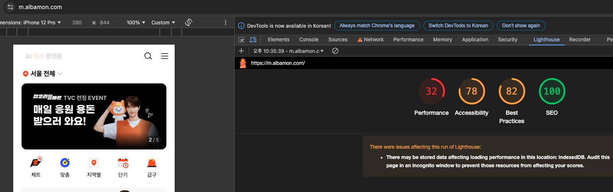
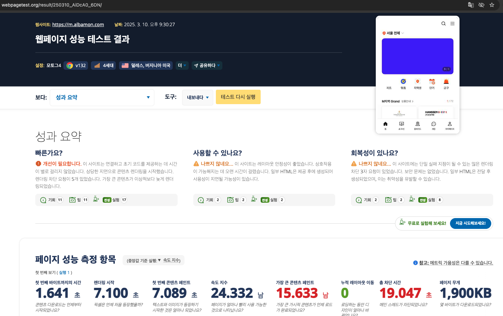

# 13장. 웹페이지의 성능을 측정하는 다양한 방법

## 애플리케이션에서 확인하기
- create-react-app 프로젝트에서 사용하는 방법
    - `web-vitals` 라이브러리는 `PerformanceObserver` 라는 API를 사용해 웹 성능 지표를 측정할 수 있다.
    ```tsx
    import {ReportHandler} from 'web-vitals';
    // ReportHandler는 웹 성능 객체(Metric)를 매개변수로 받는 함수 타입. 
    // Metric를 단순히 콘솔 출력 뿐만 아니라 서버로 전송하는 등의 작업을 할 수 있다.

    const reportWebVitals = (onPerfEntry?: ReportHandler) => {
    if (onPerfEntry && onPerfEntry instanceof Function) {
        import('web-vitals').then(({getCLS, getFID, getFCP, getLCP, getTTFB}) => {
            // do something
            getCLS(onPerfEntry); // 누적 레이아웃 이동
            getFID(onPerfEntry); // 초기 입력 지연
            getFCP(onPerfEntry); // 초기 콘텐츠풀 페인트
            getLCP(onPerfEntry); // 최대 콘텐츠 페인트
            getTTFB(onPerfEntry); // 첫 바이트까지의 시간
        });
    }
    };

    export default reportWebVitals;
    ```
- create-next-app 프로젝트에서 사용하는 방법
    - _app 페이지에 다음 코드를 추가해서 사용 가능
    ```tsx
    import { AppProps, NextWebVitalsMetric } from 'next/app';

    // 웹 성능 지표를 측정하는 함수 (reportWebVitals는 _app 애 예약어로 지정된 함수)
    export const reportWebVitals = (metric: NextWebVitalsMetric) => {
    // do something
    };
    ```

    - next.js에 특화된 사용자 지표도 제공한다.
        - Next.js-hydration: 서버 사이드에서 렌더링되어 라이드레이션 하는 데 걸린 시간
        - Next.js-route-change-to-render: 라우트 변경 시 페이지를 렌더링 시작하는데 걸린 시간
        - Next.js-render: 경로 변경이 완료된 후 렌더링이 완료되는데 걸린 시간


## 구글 라이트하우스
구글에서 제공하는 웹 페이지 성능 측정 도구.

실행 방법
- 크롬 실행 및 성능 지표를 분석하고자 하는 사이트를 (크롬의 확장 프로그램에 영향을 받지 않도록) 시크릿 모드로 방문 
- 크롬 개발자 도구에서 Lighthouse 탭을 열고 성능 분석 실행

### 탐색 모드
- 페이지에 접속했을 때부터 페이지 로딩이 완료될 때까지의 성능을 측정하는 모드.



#### Performance (성능) 😢
웹 페이지 성능과 관련된 지표를 확인할 수 있는 영역
최초 콘텐츠풀 페인트(FCP), 최대 콘텐츠풀 페인트(LCP), 누적 레이아웃 이동(CLS) 외에도
- Time to Interactive: 사용자의 인터렉션이 가능할 때까지 걸리는 시간. 3.8초 이내면 좋음, 7.3초 이내면 보통. 그 이후는 개선 필요.
    - 최초 콘텐츠풀 페인트로 측정되는 페이지 내 콘텐츠가 표시되는 시점
    - 보여지는 페이지 요소의 대부분에 이벤트 핸들러가 부착되는 시점
    - 페이지가 유저의 상호작용에 50ms 이내에 응답하는 시점
- Speed Index: 페이지가 로드되는 동안 페이지의 시각적 완성도를 측정하는 지표. 3.4초 이내면 좋음, 5.8초 이내면 보통.

- Total Blocking Time: 메인 스레드에서 특정 시간(50ms) 이상 실행되는 작업을 모아서 합산한 총 차단 시간. 

#### Accessibility (접근성)
- HTML, CSS 등에 적절한 대안을 제공하는지 확인.

#### Best Practices (권장사항)
웹 사이트를 개발 할 때 고려해야 할 요소를 얼마나 지키고 있는지 지표.
- XSS 공격에 대비하는 CSP가 적용되어 있는지 확인.
  - XSS(Cross Site Scripting) 공격: 웹 사이트에 악의적인 스크립트를 삽입하는 공격 기법.
  - CSP(Content Security Policy): 웹 사이트에서 호출할 수 있는 컨텐츠(이미지, 스타일, 스크립트, 주소, 도메인 등)를 제한하는 정책.
- HTTP 대신 보안이 더 강력한 HTTPS를 사용하는지 확인.
- 페이지 로드 시 위치정보 권한 요청 방지: 
    - 반드시 사용자의 액션 이후에 window.navigator.geolocation.getCurrentPosition(), window.navigator.geolocation.watchPosition() 등의 메서드를 호출해야 한다.
- 페이지 로드 시 알림 권한 요청 방지.
- 보안 취약점이 존재하는 자바스크립트 라이브러리를 사용하는지 확인.
- 비밀번호 입력란에 붙여넣기 허용.
- 이미지를 올바른 가로세로 비율로 표시하고 적절한 해상도로 제공 해야 함.
- 페이지에 `<!DOCTYPE html>` 문서 타입 선언이 있는지 확인.
- 적절한 charset 선언이 있는지 확인: `<meta charset="utf-8">`
- 지원 중단 api 미사용.
- 콘솔 로그로 에러가 기록되지 않게 해야 함.
- 크롬 개발자 도구 Issues 탭에서 모든 경고 확인.
- `font-display: optional`을 사용하여 폰트를 미리 로드함.

#### SEO (검색엔진 최적화)
- 문서를 크롤링하기 쉽게 만들었는지 확인.
- robots.txt 파일이 존재하는지 확인.
- 이미지와 링크에 설명 문자가 존재하는지 확인.
- `<meta>`, `<title>` 등으로 페이지 정보를 빠르게 확인할 수 있도록 함.

## webPageTest

[웹페이지 테스트 결과 보기](https://www.webpagetest.org/result/250310_AiDcA0_6DN/)

1. is it quick: 최초 바이트까지의 시간(TTFB)이 짧은지, 콘텐츠 렌더링이 즉각적으로 일어나는지, 최대 콘텐츠풀 페인트(LCP) 시간이 합리적인지?
2. is it usable: 웹 사이트의 사용성과 시각적 요소 확인. 콘텐츠 누적 이동(CLS)이 적은지, 상호작용을 빠르게 할 수 있는지, 접근성 이슈가 있는지, 클라이언트 사이드에서 과도하게 HTML을 렌더링하는지?
3. is it resilient: 보안 취약성 점검. 렌더링을 블로킹하는 제 3자 라이브러리가 있는지, 실질적인 위협이 되는 보안 위험 요소가 있는지를 확인.

## 크롬 개발자 도구
### Performance Insights
- 성능 통계 패널이 지원 중단 됨.

[성능 통계 패널이 지원 중단 예정](https://developer.chrome.com/blog/perf-tooling-2024?hl=ko#the_experimental_performance_insights_panel_will_be_deprecated)

- 대신 `성능(Performance)` 패널을 통해 Lighthouse의 성능 분석을 심층적으로 통합할 예정. 이번 통합을 통해 Lighthouse는 성능 패널 내에서 페이지 성능을 개선할 수 있는 주요 기회를 강조 표시하고, 해당하는 조치를 취하는 데 필요한 모든 세부정보를 제공함.

- 모든 성능 기능이 성능 패널로 이동하면 DevTools의 독립형 Lighthouse 패널과 기능이 중복되므로 2025년 하반기에 Lighthouse 패널이 지원 종료될 예정. (Lighthouse 패널이 중단 된다는 이야기지, Lighthouse가 지원 중단되는 건 아님.)

## pageSpeed Insights
[pageSpeed Insights 결과 보기](https://pagespeed.web.dev/analysis/https-m-albamon-com/ecwvb1jo3t?form_factor=mobile)
